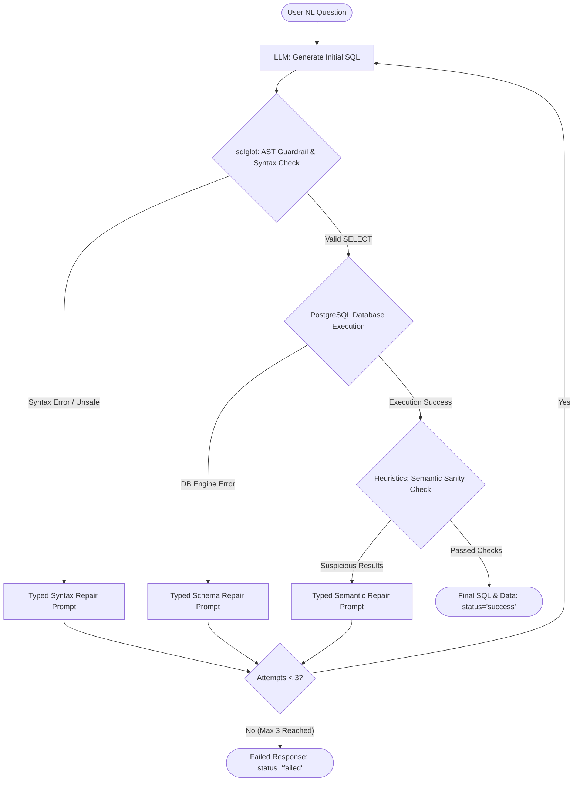

# Self-Correcting Text-to-SQL Engine with sqlglot and Execution Feedback

A production-grade, self-correcting Text-to-SQL engine built with Python, FastAPI, PostgreSQL, and `sqlglot`. It features Abstract Syntax Tree (AST) guardrails, database catalog validation, and a deterministic state-machine repair loop enforcing **Typed Self-Correction** across three distinct failure classes: **Syntax**, **Schema**, and **Semantic** errors.

---

## 1. Project Overview

Translating natural language questions to SQL using LLMs often leads to syntax errors, schema hallucinations, or silent semantic failures (e.g. Cartesian product joins or invalid date filters returning 0 rows).

This engine replaces unconstrained LLM loops with a **bounded state machine** (maximum 3 total attempts) enforcing strict repair policies:
- **AST Parsing & Guardrails (`sqlglot`)**: Rejects non-SELECT DML/DDL queries (DROP, DELETE, UPDATE, ALTER, TRUNCATE) before they reach the database.
- **Database Catalog Validation**: Catches engine errors like `UndefinedColumn` or `UndefinedTable` and feeds the full database schema catalog DDL back to the LLM.
- **Semantic Sanity Heuristics**: Detects executed queries that return suspiciously large Cartesian products (>1000 rows), unexpected empty result sets on entity queries, or single NULL aggregations.

---

## 2. Architecture



---

## 3. Folder Structure

```
project_root/
├── src/
│   ├── __init__.py
│   ├── agent.py          # Orchestrator and Typed Repair Loop State Machine
│   ├── db.py             # PostgreSQL connection and query execution layer
│   ├── guardrails.py     # sqlglot AST parsing and security guardrail logic
│   ├── heuristics.py     # Semantic sanity checks (Cartesian product, empty entity result, null aggregate)
│   └── prompts.py        # Typed repair prompts and Database Schema Catalog DDL
├── scripts/
│   ├── seed_db.sql       # SQL script populating 150 customers, 600 orders, 1800 line_items
│   └── evaluate.py       # Standalone 30-question batch evaluation harness
├── api/
│   └── main.py           # FastAPI web server exposing POST /api/query and GET /health
├── data/
│   └── eval_set.json     # 30 Natural Language evaluation questions and gold SQL queries
├── results/
│   └── evaluation_metrics.json # Automated evaluation results across 3 pipeline configs
├── tests/
│   ├── test_guardrails.py # Unit tests for AST guardrails
│   ├── test_heuristics.py # Unit tests for semantic sanity heuristics
│   ├── test_agent.py      # Unit tests for state machine repair loop transitions
│   └── test_failure_injection.py # Failure injection unit tests
├── docker-compose.yml    # Docker Compose setup for PostgreSQL and FastAPI app
├── Dockerfile            # Docker container definition for FastAPI app
├── .env.example          # Environment variable template
├── requirements.txt      # Python dependencies
└── README.md             # Project documentation
```

---

## 4. Technology Stack

- **Language**: Python 3.11+
- **API Framework**: FastAPI & Uvicorn
- **Database Engine**: PostgreSQL 15
- **AST & Parsing**: `sqlglot`
- **LLM Integration**: OpenAI Python SDK (`gpt-4o-mini`)
- **Testing**: `pytest`

---

## 5. Database Schema

The PostgreSQL database (`ecommerce_messy`) contains intentional schema traps:
- **`customers`**: `customer_id` (PK, SERIAL), `name` (VARCHAR), `region` (VARCHAR, Nullable).
- **`orders`**: `id` (PK, SERIAL), `cust_id` (FK referencing `customers.customer_id`), `order_date` (DATE), `total_amount` (NUMERIC, denormalized sum).
- **`line_items`**: `id` (PK, SERIAL), `order_id` (FK referencing `orders.id`), `product_name` (VARCHAR), `qty` (INT), `unit_price` (NUMERIC).

---

## 6. Setup and Installation

### Local Setup
1. Clone repository and install dependencies:
   ```bash
   pip install -r requirements.txt
   ```
2. Copy environment template:
   ```bash
   cp .env.example .env
   ```
3. Update `.env` with your `OPENAI_API_KEY` and local PostgreSQL credentials.

---

## 7. Environment Variables

Documented in `.env.example`:
```env
GROQ_API_KEY=your_groq_api_key_here
LLM_MODEL=openai/gpt-oss-120b
DB_HOST=db
DB_PORT=5432
DB_USER=postgres
DB_PASSWORD=postgres
DB_NAME=ecommerce_messy
```

---

## 8. Docker Instructions

Start PostgreSQL and FastAPI with automatic database seeding:
```bash
docker compose up --build
```
This initializes:
- `db` service: PostgreSQL database on port `5432` with `scripts/seed_db.sql` automatically mounted.
- `api` service: FastAPI application on port `8000` waiting for DB healthcheck.

---

## 9. API Documentation & Example Requests

Once running, access Interactive OpenAPI docs at:
`http://localhost:8000/docs`

Health check endpoint:
`http://localhost:8000/health`

### Example Request (`POST /api/query`):
```bash
curl -X POST "http://localhost:8000/api/query" \
     -H "Content-Type: application/json" \
     -d '{"question": "Show me all customers in New York."}'
```

### Example Successful Response:
```json
{
  "status": "success",
  "final_sql": "SELECT * FROM customers WHERE region = 'New York'",
  "results": [
    {
      "customer_id": 12,
      "name": "Alice Smith",
      "region": "New York"
    }
  ],
  "iterations": 1,
  "repair_history": []
}
```

### Example Response with Self-Correction:
```json
{
  "status": "success",
  "final_sql": "SELECT c.name, o.total_amount FROM customers c JOIN orders o ON c.customer_id = o.cust_id",
  "results": [...],
  "iterations": 2,
  "repair_history": [
    {
      "attempt": 1,
      "failure_type": "schema",
      "error_message": "PostgreSQL Engine Error: column orders.customer_id does not exist"
    }
  ]
}
```

---

## 10. Typed Self-Correction Policies

1. **Syntax Failure (`failure_type = "syntax"`)**:
   - Triggered when `sqlglot` fails to parse SQL or when security guardrails detect non-SELECT operations (`DROP`, `DELETE`, `UPDATE`, `INSERT`, `ALTER`, `TRUNCATE`).
   - Prompt includes malformed SQL, parser error, PostgreSQL syntax rules, and complete attempt history.

2. **Schema Failure (`failure_type = "schema"`)**:
   - Triggered when PostgreSQL engine raises column/table errors (e.g., `UndefinedColumn` for joining on `orders.customer_id` instead of `orders.cust_id`).
   - Prompt includes invalid SQL, DB engine error message, complete catalog DDL, and complete attempt history.

3. **Semantic Failure (`failure_type = "semantic"`)**:
   - Triggered when executed SQL returns suspicious result sets:
     - **Cartesian Product**: Row count > 1000 rows.
     - **Empty Entity Query**: Question asks for entities ("who", "which", "list", "top") but returns 0 rows.
     - **Single NULL Aggregation**: Aggregate sum/avg query returning `[{"sum": null}]`.
   - Prompt includes valid SQL, heuristic reason, result set sample, and complete attempt history.

4. **Maximum Attempts (Hard Cap = 3)**:
   - The loop makes at most 3 TOTAL attempts. If all 3 attempts fail, it halts, returning `status = "failed"` and `iterations = 3`.

---

## 11. Running Unit Tests

Run unit tests and failure injection tests with `pytest`:
```bash
pytest
```

Includes test suites:
- `tests/test_guardrails.py`: Verifies AST checks and non-SELECT statement blocks.
- `tests/test_heuristics.py`: Verifies Cartesian product, empty result, and single NULL aggregate heuristics.
- `tests/test_agent.py`: Verifies state machine repair loop transitions.
- `tests/test_failure_injection.py`: Verifies typed failure injection.

---

## 12. Running Batch Evaluation

Run the evaluation script across 30 questions in `data/eval_set.json`:
```bash
python scripts/evaluate.py
```
*(Requires running PostgreSQL instance and `OPENAI_API_KEY` set in environment).*

Generates metrics in `results/evaluation_metrics.json` comparing 3 configurations:
1. `zero_shot`: Single SQL generation attempt without self-correction.
2. `syntax_schema_repair_only`: Enables syntax and schema repairs, ignoring semantic heuristics.
3. `full_pipeline`: Enables syntax, schema, and semantic heuristics repairs.

---

## 13. Known Limitations

- Complex nested subquery Cartesian products may not be caught if row volume falls under 1000 rows.
- Schema catalog DDL is injected directly into prompt context; extremely large enterprise schemas (>500 tables) require schema pruning / RAG retrieval prior to context injection.
